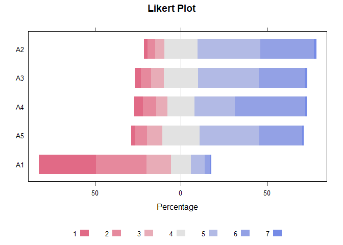
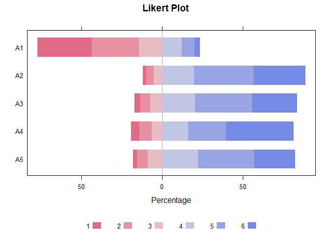
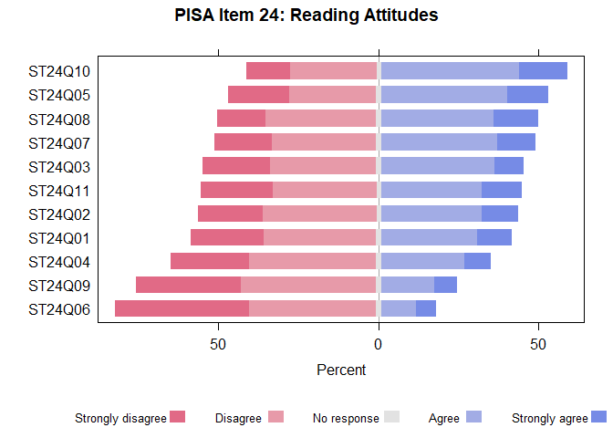
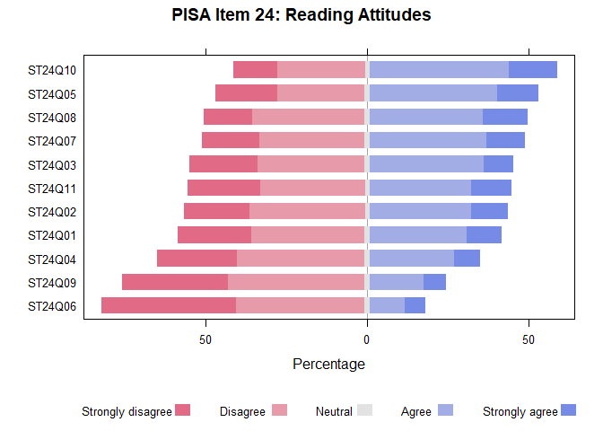

::: cell
``` {.r .cell-code}
# install.packages("devtools")
# devtools::install_github("yichen917/surveylikert", force = TRUE)

library(tidyverse)
```

::: {.cell-output .cell-output-stderr}
    ── Attaching core tidyverse packages ──────────────────────── tidyverse 2.0.0 ──
    ✔ dplyr     1.1.4     ✔ readr     2.1.5
    ✔ forcats   1.0.0     ✔ stringr   1.5.1
    ✔ ggplot2   3.5.1     ✔ tibble    3.2.1
    ✔ lubridate 1.9.3     ✔ tidyr     1.3.1
    ✔ purrr     1.0.2     
    ── Conflicts ────────────────────────────────────────── tidyverse_conflicts() ──
    ✖ dplyr::filter() masks stats::filter()
    ✖ dplyr::lag()    masks stats::lag()
    ℹ Use the conflicted package (<http://conflicted.r-lib.org/>) to force all conflicts to become errors
:::

``` {.r .cell-code}
library(dplyr)
library(tidyr)
library(ggplot2)
library(tidyr)
library(fivethirtyeight)
library(surveylikert)
```
:::

::: cell
``` {.r .cell-code}
# Example 1

library(psych)
```

::: {.cell-output .cell-output-stderr}

    Attaching package: 'psych'
:::

::: {.cell-output .cell-output-stderr}
    The following objects are masked from 'package:ggplot2':

        %+%, alpha
:::

``` {.r .cell-code}
# Load the bfi dataset
data("bfi")
head(bfi)
```

::: {.cell-output .cell-output-stdout}
          A1 A2 A3 A4 A5 C1 C2 C3 C4 C5 E1 E2 E3 E4 E5 N1 N2 N3 N4 N5 O1 O2 O3 O4
    61617  2  4  3  4  4  2  3  3  4  4  3  3  3  4  4  3  4  2  2  3  3  6  3  4
    61618  2  4  5  2  5  5  4  4  3  4  1  1  6  4  3  3  3  3  5  5  4  2  4  3
    61620  5  4  5  4  4  4  5  4  2  5  2  4  4  4  5  4  5  4  2  3  4  2  5  5
    61621  4  4  6  5  5  4  4  3  5  5  5  3  4  4  4  2  5  2  4  1  3  3  4  3
    61622  2  3  3  4  5  4  4  5  3  2  2  2  5  4  5  2  3  4  4  3  3  3  4  3
    61623  6  6  5  6  5  6  6  6  1  3  2  1  6  5  6  3  5  2  2  3  4  3  5  6
          O5 gender education age
    61617  3      1        NA  16
    61618  3      2        NA  18
    61620  2      2        NA  17
    61621  5      2        NA  17
    61622  3      1        NA  17
    61623  1      2         3  21
:::
:::

::: cell
``` {.r .cell-code}
# prepare_likert_data
trans_bfi <- prepare_likert_data(bfi,
                     question_cols = c('A1', 'A2', 'A3', 'A4', 'A5'),
                     na_action = 'omit',
                     response_levels_in_order = c(1,2,3,4,5,6))

trans_bfi
```

::: {.cell-output .cell-output-stdout}
    # A tibble: 5 × 7
    # Groups:   Question [5]
      Question   `1`   `2`   `3`   `4`   `5`   `6`
      <chr>    <dbl> <dbl> <dbl> <dbl> <dbl> <dbl>
    1 A1       33.1  29.4  14.4   12.1  8.01  2.95
    2 A2        1.69  4.54  5.45  19.9 36.9  31.5 
    3 A3        3.24  6.20  7.46  20.3 35.5  27.2 
    4 A4        4.64  7.73  6.65  16.2 23.5  41.2 
    5 A5        2.12  6.68  9.12  22.2 34.9  25.0 
:::
:::

::: cell
``` {.r .cell-code}
# check NAs
colSums(is.na(bfi))
```

::: {.cell-output .cell-output-stdout}
           A1        A2        A3        A4        A5        C1        C2        C3 
           16        27        26        19        16        21        24        20 
           C4        C5        E1        E2        E3        E4        E5        N1 
           26        16        23        16        25         9        21        22 
           N2        N3        N4        N5        O1        O2        O3        O4 
           21        11        36        29        22         0        28        14 
           O5    gender education       age 
           20         0       223         0 
:::
:::

::: cell
``` {.r .cell-code}
# Create likert plot directly from survey/questionnaire data
plot_likert(bfi, 
            c('A1', 'A2', 'A3', 'A4', 'A5'),
            na_action = 'as_category',
            response_levels_in_order = c(1,2,3,4,5,6,7),
            na_category = 7,
            main = "Likert Plot",
            positive.order = TRUE)
```

::: {.cell-output .cell-output-stderr}
    Loading required package: lattice
:::

::: {.cell-output .cell-output-stderr}
    Loading required package: grid
:::

::: {.cell-output .cell-output-stderr}
    Loading required package: latticeExtra
:::

::: {.cell-output .cell-output-stderr}

    Attaching package: 'latticeExtra'
:::

::: {.cell-output .cell-output-stderr}
    The following object is masked from 'package:ggplot2':

        layer
:::

::: {.cell-output .cell-output-stderr}
    Loading required package: multcomp
:::

::: {.cell-output .cell-output-stderr}
    Loading required package: mvtnorm
:::

::: {.cell-output .cell-output-stderr}
    Loading required package: survival
:::

::: {.cell-output .cell-output-stderr}
    Loading required package: TH.data
:::

::: {.cell-output .cell-output-stderr}
    Loading required package: MASS
:::

::: {.cell-output .cell-output-stderr}

    Attaching package: 'MASS'
:::

::: {.cell-output .cell-output-stderr}
    The following object is masked from 'package:dplyr':

        select
:::

::: {.cell-output .cell-output-stderr}

    Attaching package: 'TH.data'
:::

::: {.cell-output .cell-output-stderr}
    The following object is masked from 'package:MASS':

        geyser
:::

::: {.cell-output .cell-output-stderr}
    Loading required package: gridExtra
:::

::: {.cell-output .cell-output-stderr}

    Attaching package: 'gridExtra'
:::

::: {.cell-output .cell-output-stderr}
    The following object is masked from 'package:dplyr':

        combine
:::

::: {.cell-output .cell-output-stderr}

    Attaching package: 'HH'
:::

::: {.cell-output .cell-output-stderr}
    The following object is masked from 'package:psych':

        logit
:::

::: {.cell-output .cell-output-stderr}
    The following object is masked from 'package:lubridate':

        interval
:::

::: {.cell-output .cell-output-stderr}
    The following object is masked from 'package:purrr':

        transpose
:::

::: {.cell-output .cell-output-stderr}
    The following object is masked from 'package:base':

        is.R
:::

::: {.cell-output .cell-output-stderr}
    Warning: There was 1 warning in `mutate()`.
    ℹ In argument: `Response = fct_explicit_na(Response, na_level =
      as.character(na_category))`.
    Caused by warning:
    ! `fct_explicit_na()` was deprecated in forcats 1.0.0.
    ℹ Please use `fct_na_value_to_level()` instead.
    ℹ The deprecated feature was likely used in the surveylikert package.
      Please report the issue to the authors.
:::

::: cell-output-display

:::
:::

::: cell
``` {.r .cell-code}
# Plot likert data directly with survey/questionnair data
plot_likert(bfi, 
            c('A1', 'A2', 'A3', 'A4', 'A5'),
            na_action = 'omit',
            response_levels_in_order = c(1,2,3,4,5,6),
            main = "Likert Plot",
            positive.order = FALSE)
```

::: cell-output-display

:::
:::

::: cell
``` {.r .cell-code}
# Example 2

library(likert)
```

::: {.cell-output .cell-output-stderr}
    Loading required package: xtable
:::

::: {.cell-output .cell-output-stderr}
    Registered S3 method overwritten by 'likert':
      method      from
      plot.likert HH  
:::

::: {.cell-output .cell-output-stderr}

    Attaching package: 'likert'
:::

::: {.cell-output .cell-output-stderr}
    The following object is masked from 'package:HH':

        likert
:::

::: {.cell-output .cell-output-stderr}
    The following object is masked from 'package:dplyr':

        recode
:::

``` {.r .cell-code}
data("pisaitems")
pisa_data <- as_tibble(pisaitems)
pisa_data <- pisa_data[, c(grep("^ST24Q", names(pisa_data), value = TRUE))]

head(pisa_data)
```

::: {.cell-output .cell-output-stdout}
    # A tibble: 6 × 11
      ST24Q01        ST24Q02 ST24Q03 ST24Q04 ST24Q05 ST24Q06 ST24Q07 ST24Q08 ST24Q09
      <fct>          <fct>   <fct>   <fct>   <fct>   <fct>   <fct>   <fct>   <fct>  
    1 Disagree       Strong… Strong… Strong… Strong… Strong… Agree   Disagr… Strong…
    2 Agree          Strong… Strong… Strong… Strong… Agree   Strong… Agree   Strong…
    3 Strongly agree Strong… Strong… Agree   Strong… Strong… Strong… Agree   Disagr…
    4 Disagree       Disagr… Agree   Strong… Disagr… Disagr… Agree   Strong… Strong…
    5 Strongly disa… Disagr… Strong… Disagr… Strong… Disagr… Disagr… Agree   Agree  
    6 Agree          Strong… Strong… Agree   Strong… Agree   Strong… Agree   Strong…
    # ℹ 2 more variables: ST24Q10 <fct>, ST24Q11 <fct>
:::
:::

::: cell
``` {.r .cell-code}
# prepare_likert_data
transform_data <- prepare_likert_data(pisa_data, 
                                   colnames(pisa_data), 
                                   response_levels_in_order = c("Strongly disagree", "Disagree", "No response", "Agree", "Strongly agree"),
                                   na_action = "as_category", 
                                   na_category = "No response")
head(transform_data)
```

::: {.cell-output .cell-output-stdout}
    # A tibble: 6 × 6
    # Groups:   Question [6]
      Question `Strongly disagree` Disagree `No response` Agree `Strongly agree`
      <chr>                  <dbl>    <dbl>         <dbl> <dbl>            <dbl>
    1 ST24Q01                 22.4     35.3          1.80  30.0            10.5 
    2 ST24Q02                 20.0     35.7          1.70  31.4            11.2 
    3 ST24Q03                 20.8     33.1          1.91  35.3             8.87
    4 ST24Q04                 24.5     39.7          1.81  26.0             7.99
    5 ST24Q05                 18.9     27.1          1.82  39.4            12.7 
    6 ST24Q06                 41.4     39.9          1.95  10.8             6.02
:::
:::

::: cell
``` {.r .cell-code}
# Create likert plot using transformed data in HH::likert()
HH::likert(Question~., transform_data, 
           main = "PISA Item 24: Reading Attitudes",
           xlab = "Percent", ylab = "",
           scales = list(x = list(cex = 1),
                          y = list(cex = 1)),
           positive.order = TRUE)
```

::: cell-output-display

:::
:::

::: cell
``` {.r .cell-code}
# Plot likert data directly with plot_likert()
plot_likert(pisa_data, 
            colnames(pisa_data),
            na_action = 'as_category',
            response_levels_in_order = c("Strongly disagree", "Disagree", "Neutral", "Agree", "Strongly agree"),
            na_category = "Neutral",
            main = "PISA Item 24: Reading Attitudes",
            positive.order = TRUE)
```

::: cell-output-display

:::
:::
